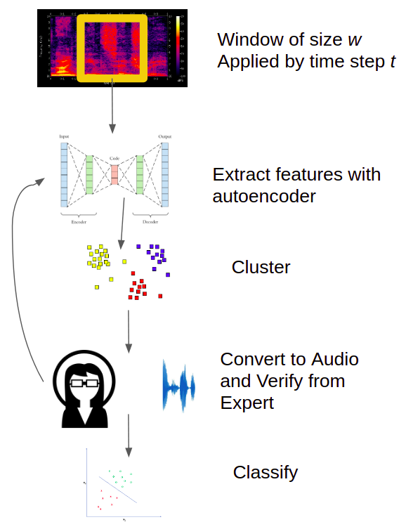

# lucidmonkeys

## Animal Communication Meets Machine Learning
## Study Project at the University of Osnabrueck, Germany

> To Those Who Will Come After Me,
> 
> I started this study project with the vision of understanding how Deep Neural Networks work, and bridging the gap between human and artificial intelligence. The task taught me a lot, about my skills and the naivete of my vision. There is only so much I achieved, but in this repository, I have laid the groundwork of taking this vision foward.
>
> The idea was to use shallow autoencoders to learn a representation of spectrograms of chimpanzee recordings, and use these low dimensional representations to cluster the audio to identify components of chimpanzee language. The spe
>
> You will find a `pipeline.py` file. This file performs the entire process of reading the data, reducing its dimensions and clustering those dimensions. I have provided an explanation of the code and commented it thoroughly in order to facilitate users in tweaking the model and running their own experiments. I have taken extra pain to reduce redundant work.
>
> We were able to produce some strong results. You are welcome to clone this repository and carry the baton forward. I will be available to answer you queries.
>
> Regards
>
> Hunaid Hameed
>
>
> _Whatever you can do or dream you can, begin it. Boldness has genius, power, and magic in it. -Goethe_

### The Vision

Building a Chimpanzee classifier does not inform us on their language, neither does it inform us on how the classifier work. However, if we keep our models small, we can apply techniques in interpretability to interpret their inner workings. This, in turn, can refine our thinking.

### The Dataset

At our disposal, is a dataset of (approximately) 2s recordings of chimpanzees which contain a:
- Pant Hoot
- Scream
- Buttressed Drumming
- Bark
- Grunt
- Food Grunt
- Pant Grunt

The files are in the folder, `/net/projects/scratch/winter/valid_until_31_July_2021/0-animal-communication/data_grid/Chimp_IvoryCoast/detector_train_ds_spec/` on the grid, and which of the above mentioned _calls_ they contain is mentioned in the file `labelsfromfilename` in this repository.

The contents of the file are also embedded in the filename, the contents were manually verified by Rachael.

### The Plan

1. Read spectrograms from a dataset
2. Train Autoencoder on it
3. Pass the data through the Autoencoder another time
4. Save the activations on the bottleneck layer in a csv file
5. Cluster these activations
6. Visualize the clusters (an interpret the visualization)
7. Compare the cluster assignment with the label assignment done by the human beings
    1. If they are similar, the model works and has the same discrimination ability as a person. Now test it on unseen/new/novel data.
    2. If they are not similar, you need reevaluate you approach and try again (or quit)

### The Infrastructure

The experiments are run on the _grid_. The grid is a technical term for a collection of computers which do not share RAM within themselves. Instructions and FAQs on how to use the grid and work with and around it are in the `grid.md` file.

### The Code

The most important file is the `pipeline.py` file. It is the pipeline through which your data goes and outputs a trained model, downsampled audio of chimpanzees and clusters this downsampled information.

The code is thoroughly commented, if you still don't get it, email me.

#### What the pipeline.py does for you

This file will:

1. Create a folder with the date and time as its name, e.g, _24Mar2021-1243_.
    All output produced by the file is saved here. This adds the convenience of keeping a log of your experiments in separate folders.
2. Read a dataset
2. Define an Autoencoder
3. Define a Dataset Loader
4. Load the Dataset
5. Define Training Parameters
6. Check if training can be done on a GPU, if not, then CPU it is
7. Write down the structure of the model in a file called `output`
8. Define optimizer and loss function of the Autoencoder
9. Normalize a spectrogram and train the Autoencoder on it
10. Save the model
11. Regenerate spectrogram images from their downsampled features and save them in a folder called `regen-samples`
12. Pass the entire dataset through the trained Autoencoder and write down the bottleneck layer features in a csv file
13. Cluster these features and save the cluster assignments in the csv file

Keep the folders for the results you like, delete the rest. The code saves all interim results, therefore, if the code crashes, you have something.

#### Output of pipeline.py
| File/Folder | Purpose |
|-------------|---------|
| output      | all standard output is in here |
| error       | all standard error is in here |
| model       | the trained model is saved here in a format pytorch is read it for reuse |
| features    | features extracted from the bottleneck layer and cluster name |
| gmmmixtures.png | image of cluster visualization |
| regen-spectrograms/ | a folder of regenerated spectrograms. the top is the original, bottom is the regenerated spectrogram. file name is the same as the filename of the spectrogram|

### Getting Started

1. Play some of the 2s recording and develop intuition of the data. Being oblivious to the data is a detriment.
2. Read and understand the code.
3. Run an experiment.
    This just means, run the `pipeline.py` file. View and interpret the results. This is your starting point.
4. Adjust the model and view and interpret the results.
5. Repeat Step 4 till you are satisfied, disheartened or exhausted.
6. Share or report your results

Now the ball is rolling..

### Our Results

We clustered the activations of an Autoencoder with 7 bottleneck neurons into 7 clusters. The number 7 was chosen because there are 7 different types of calls. Gaussian Mixture Model clustering was used. The mean values of the clusters are visualed below:

This was our last most promising result.
